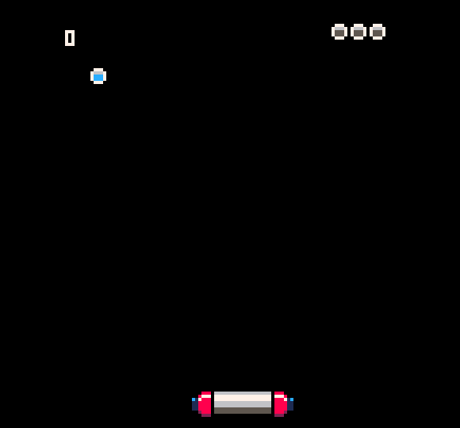

## PICO-8 games

My tiny games for the great [PICO-8](http://www.lexaloffle.com/pico-8.php) virtual console.

- `bomber_ghost`: Modified version of [a workshop example](https://github.com/juanalonso/pico8-workshop/blob/master/example_6.p8) to add input/movement to the player ghost.

- `game_of_life`: An unoptimized Conway's game of life implementation.

- `move_circle`: Simple movement test, moving a circle inside the screen without leaving the edges.

- `squashy`: Slightly improved PICO-8 Zine article game, a simplisctic Breakout/Arkanoid.

